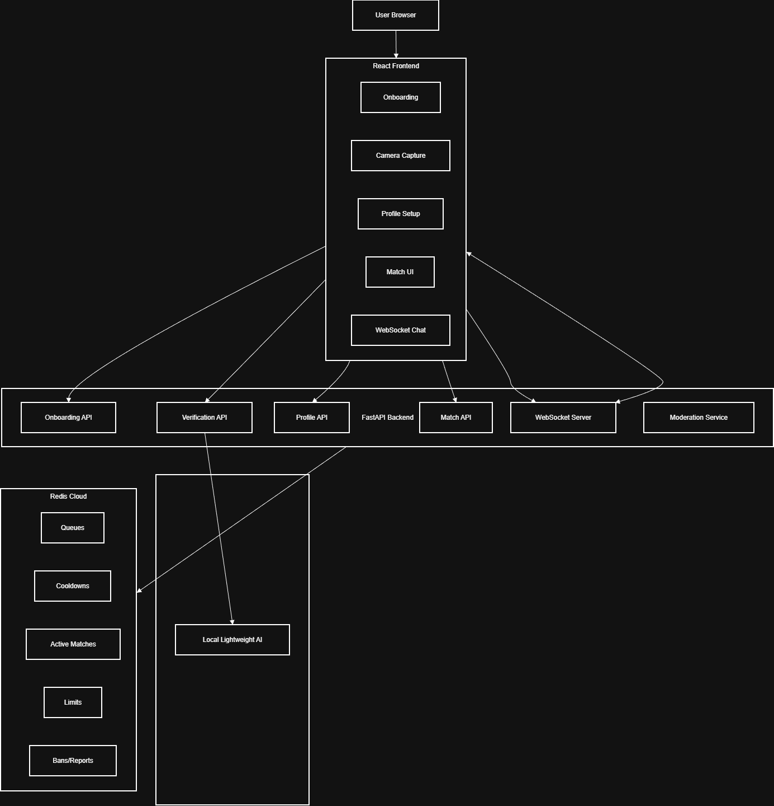

# Controlled Anonymity Chat

A privacy-first real-time anonymous chat application that balances user anonymity with safety using AI-assisted verification, intelligent matchmaking, and ephemeral messaging.

---

## 🔗 Live Demo

Frontend: https://your-app.vercel.app  
Backend: https://your-backend-name.onrender.com  

---

## 📌 Problem Statement

Traditional chat apps either require intrusive identity verification or allow unrestricted anonymity that leads to abuse.

This system implements **Controlled Anonymity**:
Users stay anonymous while the platform enforces safety using device-based identity, AI verification, and intelligent controls.

---

## ✅ Features

- Anonymous onboarding (no email/phone)
- Camera-only gender verification
- No image storage
- Pseudonymous profile (nickname + bio)
- Intelligent matchmaking
- Real-time WebSocket chat
- Ephemeral messages
- Report & auto-ban system
- Cooldowns and daily limits

---

## 🧠 Tech Stack

Frontend: React (Vite)  
Backend: FastAPI (Python)  
Realtime: WebSockets  
Database: Redis Cloud  
AI: Lightweight local classifier  

---

## 🏗 Architecture



---

## 🔐 Privacy by Design

- Images processed only in memory
- No images saved
- No chat history stored
- Only anonymous device ID used
- No personally identifiable information

---

## ▶ End-to-End Flow

1. User opens app  
2. Device ID generated locally  
3. Camera capture  
4. Gender verified  
5. Profile setup  
6. Choose match preference  
7. Find match  
8. WebSocket chat begins  
9. Leave / Next / Report  

---

## ⚙ Local Setup

### Backend

```bash
cd backend
python -m venv venv
venv\Scripts\activate
pip install -r requirements.txt
uvicorn app.main:app --reload


